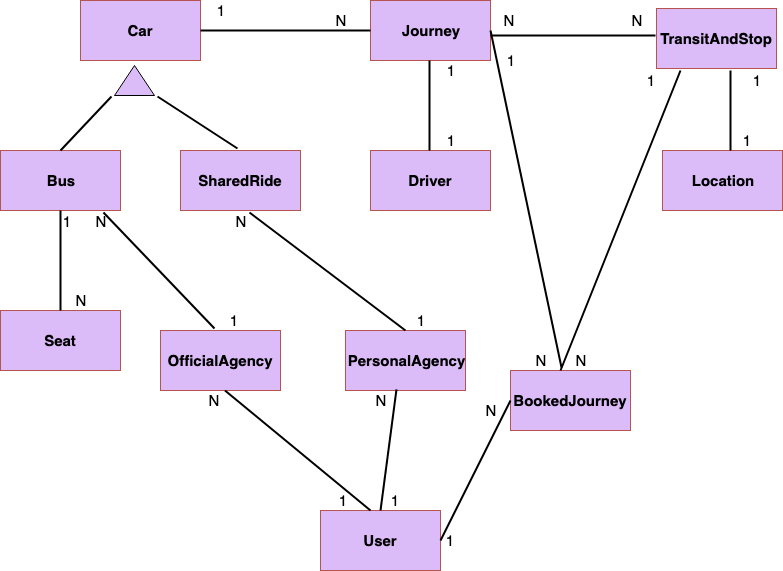

# GoWaka

GoWaka is an online booking service used by African travel agencies in the bus and train sector and event organizers for managing their operational activities with ease, GoWaka is based in Cameroon. .

GoWaka is product from Go-Groups Ltd a leading software development company in Buea. GoWaka was officially launched in January 2016 by the Go-Groups Ltd

The GoWaka service aim at providing an online booking system in Africa and other part of the world for various booking services like bus reservation, train reservation and event tickets reservation.

## Domain Object

## Component Diagram

## System Context Diagram

### To run your unit an Integration Tests
./mvnw clean package

Project Start Date September, 23 2019
